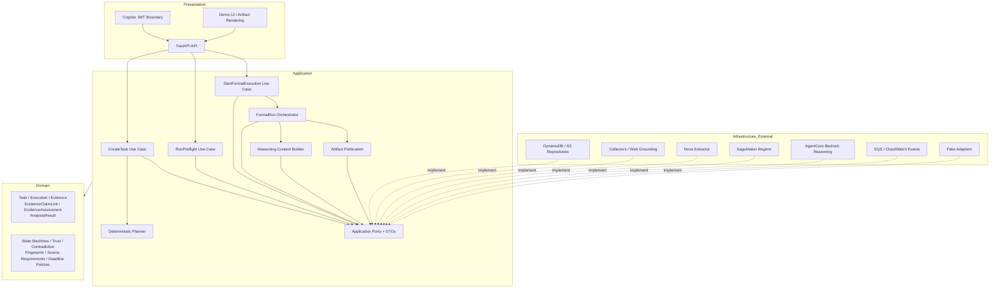
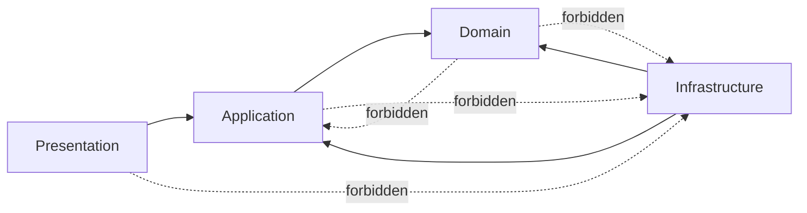
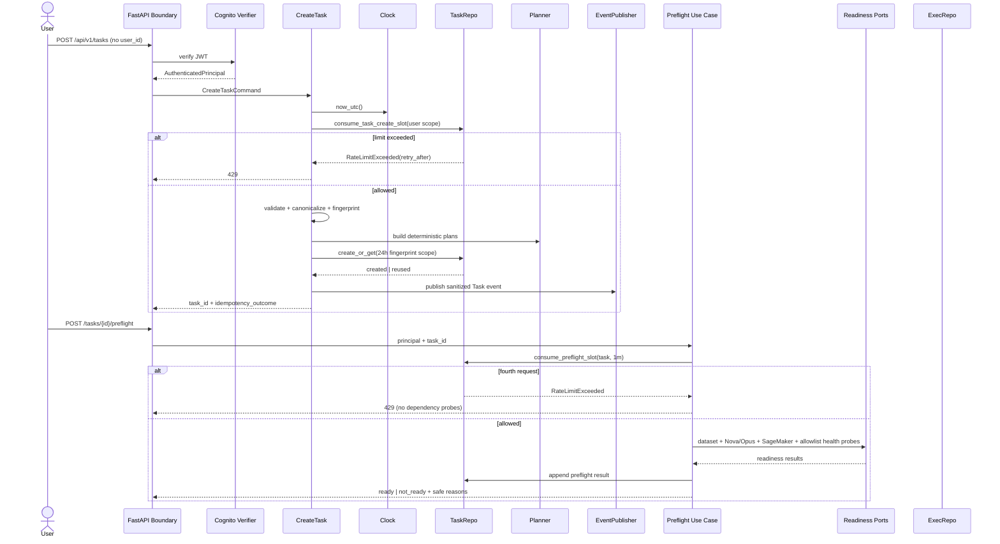
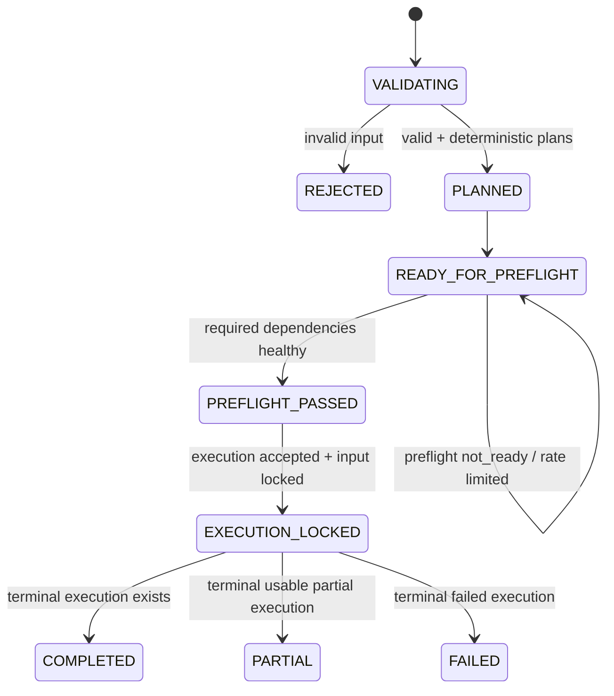
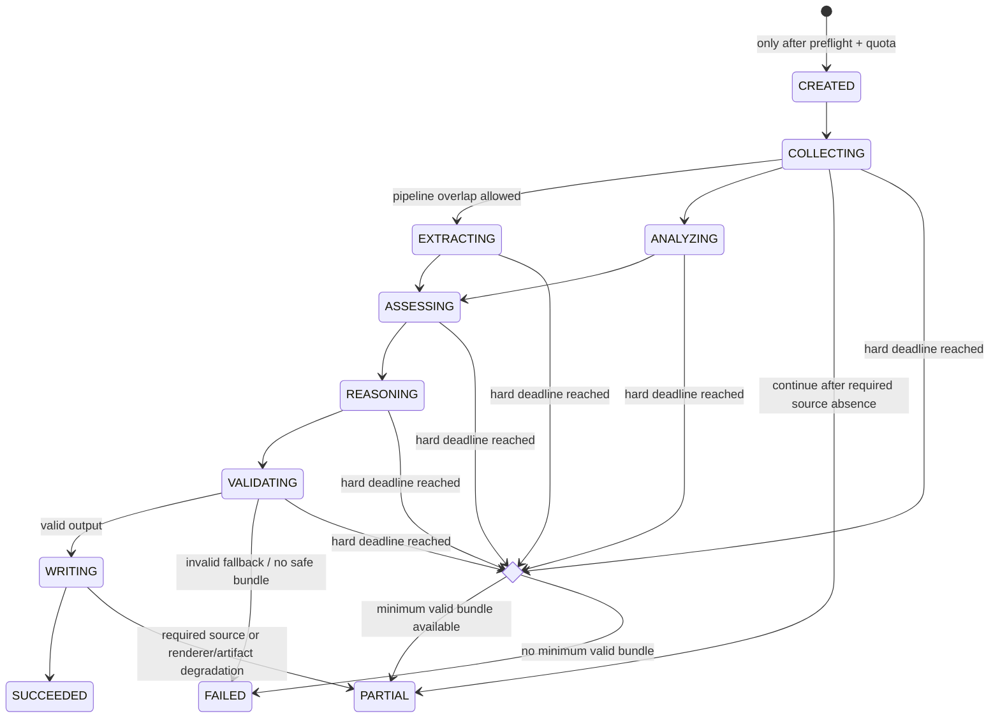

# Core Platform Design

- **設計版本**：0.2.0
- **需求基線**：`requirements.md` 0.2.0、Master Spec v0.5、`docs/architecture/source-confidence-register.md`
- **狀態**：Approved；實作仍須依 `tasks.md` 的依賴與目錄邊界執行
- **契約 authority**：`docs/architecture/ports-and-schemas.md` 為索引；Draft 2020-12 schemas 為欄位級 authority

> Master Spec 存在大量不可可靠判讀的中文片段；只採可直接確認的 FR 編號、英文 schema 名稱、JSON 範例、數值、AWS 元件、檔案路徑與清楚驗收；亂碼單獨推導標 `SOURCE_TEXT_UNCERTAIN`。ADR-001..010 已由 Maintainer 人工核准。

## 1. 設計目標與邊界

核心平台擁有 Domain entities、deterministic planning、身分後的 use-case workflow、24 小時 Task idempotency、Formal Run pre-flight/quota、Trust/Contradiction、Structured Reasoning Context、900 秒 orchestration、artifact publication 及所有外部 Port/DTO。

collector、Web Grounding、Nova、SageMaker、AgentCore、Bedrock、DynamoDB、S3、SQS、Step Functions、CloudWatch 與 UI hosting 均是外部實作。核心不得依賴其 SDK，且必須可替換為 fake adapters。

## 2. 設計決策摘要

| ID | 決策 | 狀態 |
|---|---|---|
| D-01 | Domain/Application 採 Clean Architecture；Ports 由 Application 擁有 | requirements constraint |
| D-02 | Planner 是 pure deterministic domain/application service | requirements constraint |
| D-03 | 十個 Port 的 37 methods 由 Draft 2020-12 schema 完整定義；移除 `TaskRepository.lock_for_execution` 避免禁止的分步交易，breaking draft change 仍待人工核准 | Proposed；OQ-B004 |
| D-04 | command/query DTO 隔離 Domain entity 與 provider schema | Proposed |
| D-05 | Formal orchestration 使用 900 秒 hard deadline；wire 傳 UTC+budget，receiver 建 local monotonic deadline | ADR-003 Approved |
| D-06 | Repository command 以 operation ID/hash/conditional write 支援 at-least-once delivery | Baseline approved；production resource design 仍由 OQ-B012 gate |
| D-07 | Core wire 只接受 canonical decimal string | ADR-004 Approved |
| D-08 | Evidence 使用 canonical `raw_locator`、assessment sequence 與 strong snapshot pagination | ADR-005 Approved |
| D-09 | Market adapter 不生成 fallback；Core 建立 deterministic fallback AnalysisResult | requirements constraint + schema |
| D-10 | Provider/Core ownership 與 task authority 分離 | ADR-010 Approved |

## 3. 模組圖



## 4. 依賴方向



- Domain 僅有業務 entity/value/policy/error/event。
- Application 組合 use cases、orchestration 與 Port contracts。
- Infrastructure 只透過 mapper 將 vendor payload/exception 轉成 Application DTO/error。
- FastAPI route 僅建立 `AuthenticatedPrincipal` 與 command DTO，呼叫 use case，再映射 HTTP response。

## 5. 核心模組責任

| 模組 | 責任 | 不負責 |
|---|---|---|
| Identity Boundary | 驗證 JWT、建立 principal、角色映射 | 接受 body/query/header user override |
| Fingerprint Policy | 版本化 canonicalization/hash | persistence 或 rate limit |
| Task Use Case | 限流、validate、fingerprint、atomic create-or-get、log | 建立 Formal Execution |
| Planner | 題型、dimensions、queries、budgets、ranges、matrix | 外呼、URL discovery、LLM |
| Preflight Use Case | 獨立限流、dataset/依賴 readiness aggregation | 完整 inference、消耗 quota |
| Execution Use Case | 鎖定 Task、quota acquisition、Execution 建立 | provider SDK |
| Orchestrator | DAG、stage deadline、降級、state transition | vendor-specific retry |
| Evidence Pipeline | normalize、immutability、link、assessment、dedup | 把 assessment 寫回 Evidence |
| Analysis | deterministic metrics、provider result mapping | LLM 猜數字 |
| Trust/Contradiction | versioned scores/groups/conflicts/confidence input | 隱藏 counter evidence |
| Context Builder | validated/bounded references | raw HTML、secret、跨 Task evidence |
| Publication | schema/citation/numeric audit、render、hash、manifest | 發布未驗證 output |

## 6. 主要 sequence diagram

### 6.1 Task 建立與 Pre-flight



### 6.2 Formal Run

```mermaid
sequenceDiagram
  actor User
  participant API
  participant Start as StartExecution
  participant Repo as Task/Execution Repositories
  participant Orch as Orchestrator
  participant C as SourceCollector
  participant X as EvidenceExtractor
  participant E as EvidenceRepository
  participant M as MarketRegimeProvider
  participant R as ReasoningProvider
  participant A as ArtifactRepository
  participant V as EventPublisher

  User->>API: POST /tasks/{id}/executions
  API->>Start: verified principal + task_id
  Start->>Repo: ExecutionRepository.acquire_quota_and_create(fresh pass, input_lock_hash)
  Note over Start,Repo: sole atomic authority: revalidate + Task input lock + quota + Execution + consume
  alt not ready / stale / expired / quota exhausted
    Repo-->>Start: method-specific typed denial
    Start-->>API: mapped 409/422/429 (no quota consumed)
  else accepted
    Repo-->>Start: created Execution (idempotent replay returns same result)
    Start->>Orch: execute(plan, absolute_deadline=900s)
    par non-market planned collection jobs
      Orch->>C: collect(approved category/query/budget)
      C-->>Orch: success/skipped/failed + RawRecords
    and required market data path
      Orch->>C: collect official dataset / approved live extension
      C-->>Orch: validated market records + lineage
      Orch->>Orch: compute deterministic, time-aligned features
      Orch->>M: infer(validated features, timeout<=25s)
      M-->>Orch: schema-valid regime result or typed failure
      alt provider failure / invalid output
        Orch->>Orch: create versioned deterministic fallback AnalysisResult
      end
    end
    loop each successful RawRecord
      Orch->>X: extract(schema-bound, deadline)
      X-->>Orch: claims or invalid
      Orch->>E: append immutable Evidence/links/assessments
    end
    Orch->>Orch: dedup + trust + contradictions + bounded context
    Orch->>R: reason(context, Opus)
    alt invalid Opus output
      Orch->>R: one repair within 60s
    end
    alt repair failed
      Orch->>R: Sonnet fallback
    end
    Orch->>Orch: schema/citation/numeric/lineage validation
    alt publication valid
      Orch->>A: put canonical JSON then renderable artifacts
      Orch->>A: put Manifest last
    else invalid fallback
      Orch->>Repo: safely fail; no unverified report
    end
    Orch->>V: sanitized major-step events
    Orch->>Repo: terminal Execution status
  end
```

## 7. 狀態機

### 7.1 Task



Task idempotency reuse 回傳既有 aggregate，不新增狀態。依 ADR-006 提案，Pre-flight pass 綁定 `task_id`/`task_version`/`input_lock_hash`/`dependency_snapshot_hash`，TTL 固定 60 秒且 single-use；Execution start 只透過 `ExecutionRepository.acquire_quota_and_create` 在同一原子操作重驗、鎖定 Task input、取得 quota、建立 Execution 並 consume pass，TaskRepository 無獨立 lock。pass expired 或 binding 變更時回到 `READY_FOR_PREFLIGHT`，且不消耗 quota。

### 7.2 Execution



合法 terminal states：`SUCCEEDED`、`PARTIAL`、`FAILED`。每次 transition 需 conditional version check，避免重送事件造成倒退。

## 8. Domain 與資料 schema

以下是 v1 core schema 提案；`Evidence` 三 schema 保留 Master Spec 欄位。完整 Port wire DTO 見 `docs/architecture/ports-and-schemas.md`。

### 8.1 Task

```json
{
  "schema_version": "1.0.0",
  "task_id": "TASK-001",
  "principal_subject_hash": "stable-pseudonymous-id",
  "question": "分析 BTC 過去兩週的市場狀況",
  "assets": ["BTC"],
  "timeframe": {"start": "2026-07-18T00:00:00Z", "end": "2026-08-01T00:00:00Z"},
  "question_type": "market_status",
  "formal_run_intent": true,
  "request_fingerprint": "sha256:<digest>",
  "fingerprint_ruleset_version": "pending-open-question",
  "planner_ruleset_version": "planner-1.0.0",
  "sourcing_plan_id": "PLAN-S-001",
  "analysis_plan_id": "PLAN-A-001",
  "state": "ready_for_preflight",
  "created_at": "2026-08-01T00:00:00Z",
  "version": 1
}
```

`principal_subject_hash` 是 persistence/log pseudonym；授權流程仍使用可信 principal，不以 pseudonym 取代驗證。

### 8.2 Execution

```json
{
  "schema_version": "1.0.0",
  "execution_id": "EXEC-001",
  "task_id": "TASK-001",
  "request_fingerprint": "sha256:<digest>",
  "attempt_number": 1,
  "original_execution_id": null,
  "technical_failure_code": null,
  "state": "collecting",
  "outcome": null,
  "started_at": "2026-08-01T02:00:00Z",
  "absolute_deadline_at": "2026-08-01T02:15:00Z",
  "completed_at": null,
  "partial_reasons": [],
  "failure": null,
  "version": 1
}
```

### 8.3 Evidence、Claim Link、Assessment

欄位級 authority：[`docs/architecture/schemas/evidence_repository/contract.schema.json`](../../../docs/architecture/schemas/evidence_repository/contract.schema.json)。本 Design 不複製 JSON 欄位，避免 prose/schema drift。

- `EvidenceDTO` immutable；canonical locator 是 `raw_locator`；包含 raw/clean SHA-256、`ContentReferenceDTO`、query provenance、task/execution/raw-record lineage 與 active/quarantined status。
- `EvidenceClaimLinkDTO.stance = supports|contradicts|context`，append-only、多對多。
- `EvidenceAssessmentDTO` 使用 per-evidence 單調 `assessment_sequence`；latest 取最大 sequence，不以 timestamp/version 字串 tie-break。
- List default 50、range 1..200，以 task-scoped strong snapshot token/cursor 分頁。
- 同 ID + 相同 canonical payload 是 no-op；同 ID + 不同 payload 是 integrity conflict。

所有精確數值依 ADR-004 使用 canonical decimal string；Master/provider JSON number 僅在 boundary 直接以 Decimal parser 轉換，不可先經 binary float。

### 8.6 AnalysisResult

```json
{
  "schema_version": "1.0.0",
  "analysis_id": "AN-001",
  "task_id": "TASK-001",
  "execution_id": "EXEC-001",
  "analysis_type": "market_regime",
  "asset": "BTC",
  "as_of": "2026-08-01T00:00:00Z",
  "source_refs": ["DATASET:BTC_daily_ohlcv.csv:lines:100-130"],
  "feature_window": {"start": "2026-07-03", "end": "2026-08-01"},
  "values": {
    "bullish_probability": "0.42",
    "bearish_probability": "0.21",
    "sideways_probability": "0.37",
    "anomaly_score": "0.18"
  },
  "quality": {"status": "valid", "limitations": []},
  "producer": {"kind": "model", "name": "market-regime-xgboost", "version": "1.0.0"},
  "computed_at": "2026-08-01T02:09:00Z"
}
```

Provider success 使用 `producer.kind=model`。Provider timeout/unavailable/invalid output 時，Adapter 只回 typed error；Core 建立新 `AnalysisResult`，使用 `producer.kind=deterministic_fallback` 與版本化 formula/ruleset，保留 source refs、quality/limitations，且不得偽造 provider probabilities。

### 8.7 Structured Reasoning Context

```json
{
  "schema_version": "1.0.0",
  "task_id": "TASK-001",
  "execution_id": "EXEC-001",
  "question": "分析 BTC 過去兩週的市場狀況",
  "assets": ["BTC"],
  "timeframe": {"start": "2026-07-18T00:00:00Z", "end": "2026-08-01T00:00:00Z"},
  "evidence_refs": [
    {"evidence_id": "EV-20260801-001", "assessment_id": "ASSESS-000045", "assessment_version": "1.0.0", "stance": "supports"}
  ],
  "analysis_refs": ["AN-001"],
  "contradictions": [
    {"contradiction_id": "CON-001", "type": "signal", "left_ref": "AN-001", "right_ref": "EV-20260801-001"}
  ],
  "source_coverage": {"market": "success", "news": "success", "official": "failed"},
  "limitations": ["required official source unavailable"],
  "ruleset_versions": {"planner": "planner-1.0.0", "trust": "trust-rules-1.0.0"}
}
```

禁止欄位：raw HTML、secret/token、完整 prompt history、跨 Task reference、quarantined content。欄位級 authority 是 [`reasoning_provider/contract.schema.json`](../../../docs/architecture/schemas/reasoning_provider/contract.schema.json)：canonical JSON≤524288 bytes、provider tokenizer≤64000 tokens、Evidence≤120、Analysis≤32、Contradiction≤64、Limitations≤50、question/excerpt≤2000 Unicode scalars；Context Builder 以 deterministic rank/truncate 產生 omissions。

### 8.8 Reasoning output reference graph

```json
{
  "schema_version": "1.0.0",
  "facts": [{"fact_id": "FACT-001", "text": "...", "source_refs": ["EV-20260801-001", "AN-001"]}],
  "inferences": [{"inference_id": "INF-001", "text": "...", "fact_refs": ["FACT-001"]}],
  "conclusions": [{"conclusion_id": "CONCLUSION-001", "text": "...", "support_refs": ["FACT-001", "INF-001"]}],
  "limitations": ["..."],
  "watchpoints": ["..."],
  "final_confidence": {"score": "0.63", "component_refs": ["ASSESS-000045", "CON-001"]}
}
```

### 8.9 Artifact publication contract

欄位級 authority：[`docs/architecture/schemas/artifact_repository/contract.schema.json`](../../../docs/architecture/schemas/artifact_repository/contract.schema.json)。Normal run 產生全部格式；degraded minimum 是 Final Report JSON、Evidence List JSON、Execution Log JSONL、Manifest JSON。缺任一 minimum 不得 publish。Manifest 最後寫入、列 available/missing/reason 且不自列；Markdown/HTML/CSV renderer failure 可形成 `partial`。

## 9. Deterministic Planner

Planner input 為 normalized question/assets/timeframe、planner ruleset version 與明確 clock snapshot。Output：

- `question_type`
- `answer_dimensions`
- `source_requirement_matrix`
- 每類固定 `queries`
- 每 job priority、budget、資產與 fallback policy
- warm-up/reporting range
- deterministic analysis steps

Determinism 驗證：相同 input/ruleset/clock snapshot canonical JSON 完全一致；assets 在 fingerprint 階段排序，但 asset comparison 的「第一資產優先」需要保留 presentation order，因此 Task 應同時保有 canonical asset set 與 requested asset order。此差異是重要設計提案，需在 fingerprint SPEC 明定。

## 10. Pre-flight 與正式額度

### Pre-flight result

```json
{
  "schema_version": "1.0.0",
  "task_id": "TASK-001",
  "checked_at": "2026-08-01T01:59:00Z",
  "ready": false,
  "checks": [
    {"name": "official_dataset", "required": true, "status": "healthy", "safe_reason_code": null},
    {"name": "reasoning_provider", "required": true, "status": "unhealthy", "safe_reason_code": "provider_unavailable"}
  ]
}
```

- Rate limit 在任何 probe 前檢查。
- Probe 不執行完整推論，不建立 Execution、不取得 quota。
- Pass 記錄 `preflight_id`、`task_id`、`task_version`、`input_lock_hash`、`dependency_snapshot_hash`、`checked_at`、`expires_at` 與 consume fields；TTL 固定 60 秒且 single-use。
- Execution start 只呼叫 `ExecutionRepository.acquire_quota_and_create`，由該唯一 authority 在單一原子操作重驗 freshness/binding、鎖 Task input、取得 `(trusted_user_scope, fingerprint)` quota、建立 Execution 並 consume pass；`TaskRepository` 不提供獨立 lock。任何 failure、stale、expired 或 rollback 都不建立 Execution、不耗 quota。

### Quota invariant

```text
scope = (trusted_user_id, request_fingerprint)
normal_attempts <= 1
admin_technical_reruns <= 1
formal_executions_total <= 2
attempt 2 requires admin authorization + original_execution_id + technical_failure_code
failure of attempt 2 => manual_case; no further automatic formal execution
```

## 11. 900 秒 deadline budget

| Stage | Target window | Hard deadline from T0 | Adapter/use-case policy |
|---|---:|---:|---|
| validate/task/classify | 0–20s | 30s | no external call |
| sourcing/analysis plans | 20–90s | 120s | deterministic only |
| collection | 90–360s | 450s | parallel; stop low priority first |
| extraction/evidence/dedup | 180–480s | 510s | overlap; Nova repair ≤20s once |
| deterministic/SageMaker | 450–570s | 600s | SageMaker ≤25s once + 5s switch |
| trust/contradiction/context | 570–660s | 690s | no unbounded work |
| reasoning | 660–780s | 810s | Opus repair ≤60s once, then fallback |
| publication validation | 810–860s | 875s | reject invalid output |
| write/manifest/UI | 875–895s | 900s | 20s target + 5s buffer |

Orchestrator 在自身 runtime 以 `Clock.monotonic_ms()` 建立 local `T0` 與 local hard deadline。跨 process command 只傳 `DeadlineDTO(schema_version, operation_id, deadline_at_utc, budget_ms, sent_at_utc, safety_margin_ms)`；receiver 以自己的 monotonic clock 建 local deadline，effective timeout 取 provider limit、budget 與 UTC remaining minus margin 的最小值。不同 runtime 的 monotonic 值永不傳遞或比較。Step Functions、Lambda、HTTP 與 SDK timeout 是 outer guards，不可延長 deadline。Stage 專屬 buffer 不可被前段自動消耗；無足夠預算時不啟動 I/O，依 requirement classification 收斂為 skipped/failed/partial。

## 12. 錯誤模型與降級

統一 application error envelope：

```json
{
  "schema_version": "1.0.0",
  "code": "provider_timeout",
  "category": "timeout",
  "retryable": false,
  "safe_message": "Market regime provider timed out",
  "provider": "market_regime",
  "details": {},
  "occurred_at": "2026-08-01T02:09:25Z"
}
```

`details` 僅允許 allowlisted、安全欄位；vendor exception、request raw payload、secret 不得穿越 boundary。

| 情境 | Core 行為 | outcome |
|---|---|---|
| 官方 dataset readiness 失敗 | 終止，不替換 | failed |
| required source 缺席 | 繼續、強制 limitation | partial |
| required-if-available 缺席 | limitation | 不單獨 partial |
| optional skipped/failed | 繼續並記錄 | 不單獨 partial |
| live extension 缺口 | 不 forward-fill；缺 required coverage 時 partial | partial/limitation |
| Nova invalid schema | 一次 repair ≤20s，否則 quarantine | continue/partial as coverage dictates |
| MarketRegimeProvider timeout/failure/invalid output | Adapter 零 retry 且只回 typed error；Core 建立版本化 deterministic fallback AnalysisResult | continue + disclose provider absence |
| Primary reasoning invalid/failure | 一次 repair ≤60s，然後 Core 選 fallback model | continue if valid fallback |
| Fallback reasoning invalid | 不發布未驗證 report；只保留 Evidence List JSON、Execution Log JSONL 等非報告稽核資料，不宣稱 minimum publishable bundle | failed |
| Citation missing | 拒絕；納入同一次 primary repair budget | repair/fallback |
| Renderer failure | 保留 canonical minimum；Manifest 記 missing/reason | partial |
| approaching deadline | 停低優先工作；只有四項 minimum 都有效才 publish | partial/succeeded/failed |

### HTTP mapping 提案

- validation：422
- unauthenticated/invalid JWT：401；authenticated but forbidden：403
- rate limit：429 + safe retry-after
- idempotency reuse：200；新 Task：201
- stale/not-passed preflight 或 quota conflict：409（待核准）
- unexpected safe server error：500，不回傳 provider raw error

## 13. Trust、independence 與 Contradiction pipeline

```text
immutable Evidence
  → duplicate features (canonical URL/hash/title/entity/time)
  → versioned independence grouping
  → versioned source trust/relevance/freshness/consistency assessments
  → claim links (support/counter/context)
  → contradiction detection (numeric/temporal/source/narrative/signal/status)
  → decomposable confidence inputs
  → bounded Reasoning Context
```

- Assessment selection 以 per-evidence 最大 `assessment_sequence` 決定 latest；timestamp 只作稽核，不參與 latest tie-break。
- Contradiction 不是刪除規則，而是具雙邊 reference 的分析物件。
- 重複 group 只計一個 independence corroboration；代表來源選擇規則待 allowlist SPEC。

## 14. FastAPI application/use-case boundary

```text
HTTP request
→ JWT verification / AuthenticatedPrincipal
→ request schema validation
→ Application command DTO
→ use case
→ Application result / typed error
→ HTTP response mapping
```

禁止：route 直接用 repository、把 `Request` 傳入 use case、Domain error 包含 HTTP status、body 提供 `user_id`、adapter 回傳 Boto3/Bedrock response 至 Application。

API path 沿用 Master Spec：

- `POST /api/v1/tasks`
- `POST /api/v1/tasks/{task_id}/preflight`
- `POST /api/v1/tasks/{task_id}/executions`
- `GET /api/v1/tasks/{task_id}`
- `GET /api/v1/tasks/{task_id}/evidence`
- `GET /api/v1/tasks/{task_id}/artifacts`
- `GET /api/v1/executions/{execution_id}/events`
- `GET /api/v1/reports/{report_id}`
- `GET /api/v1/health`
- `GET /api/v1/ready`

## 15. Event 與 Execution Log

EventPublisher 接受已安全化 `ExecutionEventDTO`。必要欄位：schema version、event ID、timestamp、task/execution IDs、step、tool/adapter、status、duration、retry count、sanitized parameters、result summary、typed error、remaining deadline。

額外稽核：

- Task create：fingerprint、ruleset version、created/reused、rate-limit outcome。
- Assessment 使用：evidence/assessment ID 與 assessment version。
- Web Grounding：approved category/query、URL count、逐 URL allowlist result/reason。
- Admin rerun：original execution、technical failure code、quota count、authorizing principal pseudonym。

EventPublisher failure 不得讓核心把 secret 放到 fallback log；關鍵 audit event 無法持久化時的 Formal Run outcome 待 Open Question 決定。

## 16. Artifact publication 與 UI

1. 建立並驗證 canonical Final Report JSON。
2. 建立 Evidence List JSON 與 redacted Execution Log JSONL。
3. 若剩餘 budget 允許，以 canonical models render Markdown/HTML/CSV；renderer failure 記為 missing，不改 canonical。
4. 計算逐檔 SHA-256/size/MIME/schema version並寫入 ArtifactRepository。
5. 確認 Final Report JSON、Evidence List JSON、Execution Log JSONL 三項 minimum 均存在。
6. 最後建立 Manifest JSON，列 available/missing/reason 且不自列；Manifest 成功後才更新 Execution/UI publication status。

缺任一四項 minimum（含 Manifest）不得 publish。

Demo UI 僅讀 application query result/artifact DTO；不得直接讀 DynamoDB/S3。需要顯示進度、剩餘時間、partial reasons、artifact availability、Evidence lineage、assessment version 與 contradiction references。

## 17. Fake-adapter 本機 E2E

最小 composition：

- In-memory `TaskRepository`、`ExecutionRepository`、`EvidenceRepository`、`ArtifactRepository`
- Recording `EventPublisher`
- Scenario-driven `SourceCollector`
- Schema-valid/invalid `EvidenceExtractor`
- success/timeout `MarketRegimeProvider`
- success/repair/fallback-invalid `ReasoningProvider`
- controllable fake `Clock`

Fake 必須模擬 timeout、重送、併發 create-or-get、partial source、quarantine、MarketRegimeProvider typed failure + Core deterministic fallback AnalysisResult、primary reasoning repair/fallback-invalid、renderer failure 與 900 秒逼近情境，且不得使用 production network/AWS secret。

## 18. Contract、integration 與 architecture validation

- 每個 Port 由 reusable contract suite 驗證 schema version、逐 operation `x-method-policy`（timeout/retry/idempotency/concurrency）、method-specific `ErrorResult` 與 unknown exception → `unexpected_provider_error`。
- Shared semantic assertions 驗證 Evidence offset/token TTL-expiry consistency、Reasoning citation/reference graph 與 Artifact Manifest available/missing/reason/self-exclusion 跨欄 invariant。
- Dataset integration 驗證五檔、1,826 rows、UTC/USDT/Decimal、lineage 與 live transition。
- FastAPI integration 驗證 principal 不可由 client override、status mapping、route 不直連 adapter。
- Architecture test 掃描非法 imports。
- Core-owned integration 只在 `tests/integration/core/` 且使用 fake/local boundaries；真實 AWS/provider integration 只在 `tests/integration/providers/`、顯式 opt-in，與 fake-based CI 分離。
- E2E 覆蓋三題型、source matrix、24h idempotency、10/hour、3/minute、quota across task、admin rerun、25s timeout、deadline、double-asset partial、citation audit 與 artifacts。

## 19. 需求追蹤

| Design section | Requirements |
|---|---|
| 3–5 模組與依賴 | CP-ARCH-01..04、CP-PORT-* |
| 6 sequence | CP-FR001、CP-FR003..011 |
| 7 state machines | CP-FR001-10、CP-FR011-* |
| 8 schemas | CP-FR005-*、CP-FR007-*、CP-FR009-*、CP-FR010-* |
| 9 planner | CP-FR002-* |
| 10 preflight/quota | CP-FR011-01..10 |
| 11 budget | CP-FR011-11..12、CP-ARCH-08 |
| 12 degradation | CP-FR002-06..08、CP-FR007-07..08、CP-FR009-05..08、CP-FR010-06 |
| 13 trust | CP-FR006-*、CP-FR008-* |
| 14 API | CP-FR001-*、CP-ARCH-04 |
| 15 log | CP-FR001-11、CP-FR003-03、CP-FR010-08、CP-FR011-09 |
| 16 artifacts/UI | CP-FR010-*、CP-FR011-13 |
| 17–18 validation | CP-PORT-04..05、驗收追蹤表 |

## 20. Decision gates

所有 decision 的單一清單是 `docs/architecture/open-questions.md`：OQ-B001..B011 與 ADR-001..010 已核准；OQ-B012..B015 維持 phase-specific blocking；OQ-N001..N005 為 nonblocking。

- T10 只依賴 T01，以及 OQ-B001～OQ-B011 中與 T01 schema freeze／T10 ownership boundary 直接相關的決策；OQ-B004 雖已通過 Draft 2020-12/examples 驗證，仍等待 human schema review。
- OQ-B012～OQ-B015 不阻塞 T10，也不阻塞不依賴 production policy 的 Domain entities、Application Port/strategy interfaces、in-memory fakes、report DTO/renderer skeleton 或 architecture tests。
- Provider/Core ownership 與 task authority 依 ADR-010；Provider 唯一進度來源是 `.kiro/specs/provider-adapters/tasks.md`。
- 只由不可可靠判讀文字推導的新內容標 `SOURCE_TEXT_UNCERTAIN`，不得成為 implementation acceptance。

### 20.1 Phase-specific decision gates

未解決的 production policy 不妨礙先建立穩定 interface 與 fake boundary，但 fake behavior 必須明確標示為 non-production ruleset，不得被 production composition 使用或作為 production-complete 證據。Decision owner 核准前，不得宣稱對應 capability production-complete，production composition root 亦不得接入未核准的 adapter/ruleset。

| Decision | 不阻塞 | 阻塞的 production implementation |
|---|---|---|
| OQ-B012 | T10、Domain entities、Application Repository Port、in-memory repository/quota fake | AWS persistence production adapter、DynamoDB transaction/key/index、distributed concurrency/quota/idempotency integration；對應 Provider PA74 persistence slice |
| OQ-B013 | T10、官方 CSV dataset reader、historical-range analysis、fake live-extension adapter | 真實 live market provider、credentials/readiness、2026-05-31 後 production-complete reporting；對應 Provider PA70 live-extension slice |
| OQ-B014 | T10、Evidence entities、dedup strategy interface、fake dedup | Core T54 production dedup/independence ruleset、allowlist/threshold/clustering/tie-break/scoring |
| OQ-B015 | T10、EvidenceAssessment entity/schema、Trust/Confidence strategy interface、fake scoring、report DTO/renderer skeleton | Core T55 production trust/relevance/freshness/consistency、contradiction severity 與 final confidence rulesets |

T60/T80 可使用清楚標示的 deterministic fakes 驗證 orchestration；T81 production dress rehearsal 必須等待 T54/T55 與 PA70/PA74 對應 production slices通過各自 gate。
